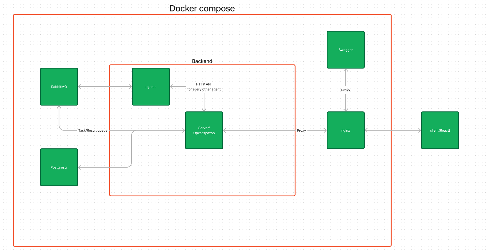
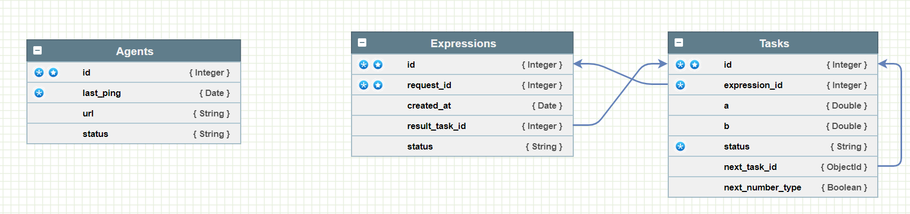
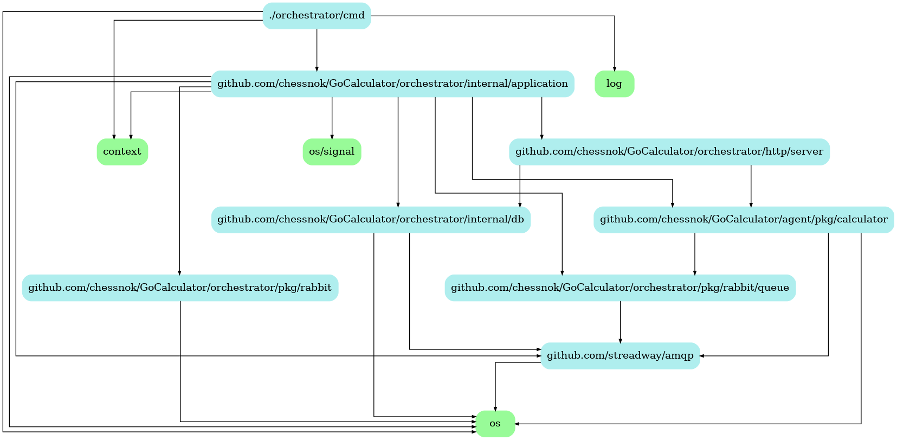

# Go Calculator

## Installation

1. Rename all files in env folder from `env.service_name.example` to `.env.service_name`
2. Run `docker-compose up -d`
3. Open `http://localhost` in your browser
4. Check docs at `http://localhost/api/docs`
5. Enjoy!
6. Turn off the server with `docker-compose down`

## Structure

    

        
Project structure

        
    

    

        
DB structure

        
    

    

        
Go packages structure

        
    

### Technologies

#### Backend

- Golang
- Echo
- Docker
- Docker-compose
- PostgreSQL
- Nginx
- Swagger

#### Frontend

- React
- JavaScript
- HTML
- CSS

## Contributing

### Contact me

- [Telegram](https://t.me/mikhailfadin)
- [Email](mailto:fadin.edu@gmail.com)